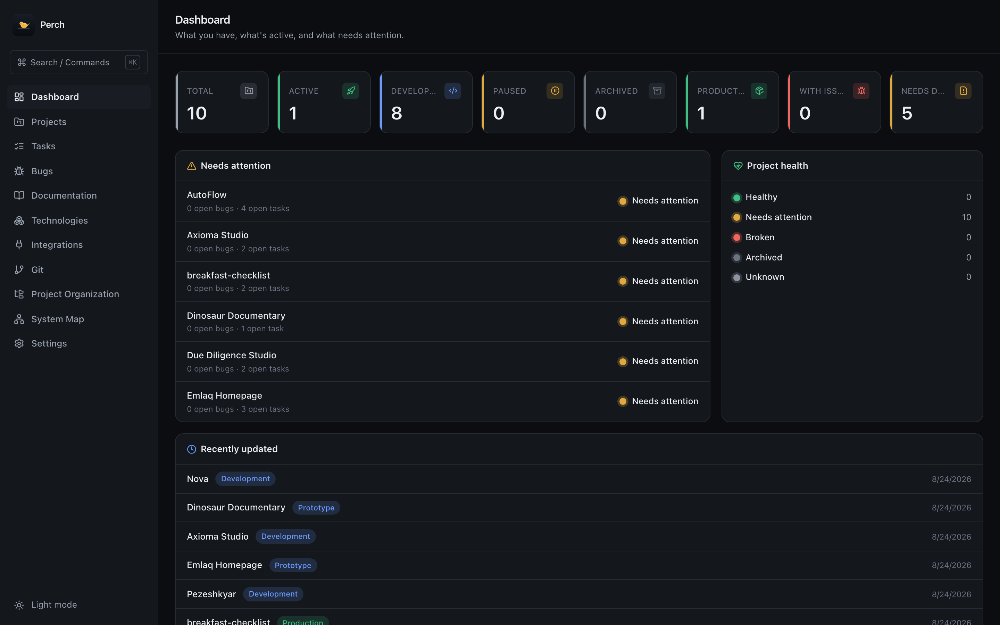
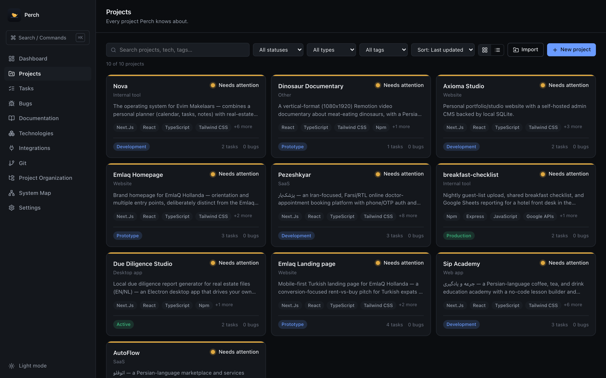
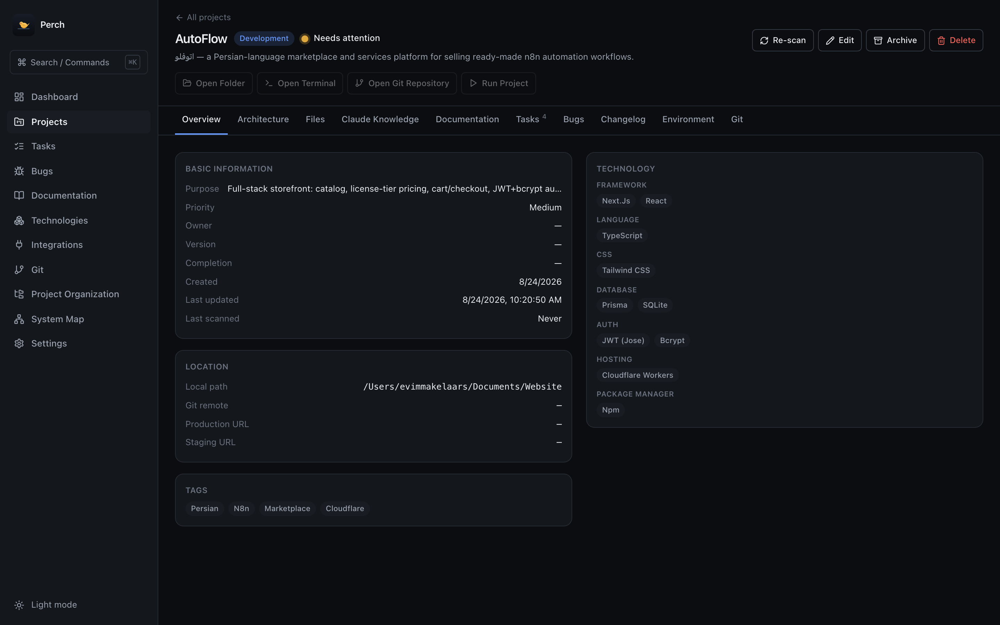
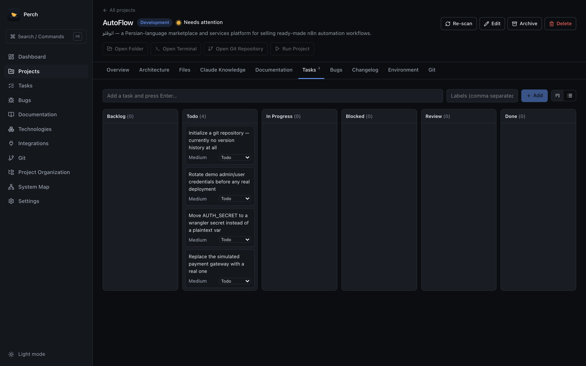
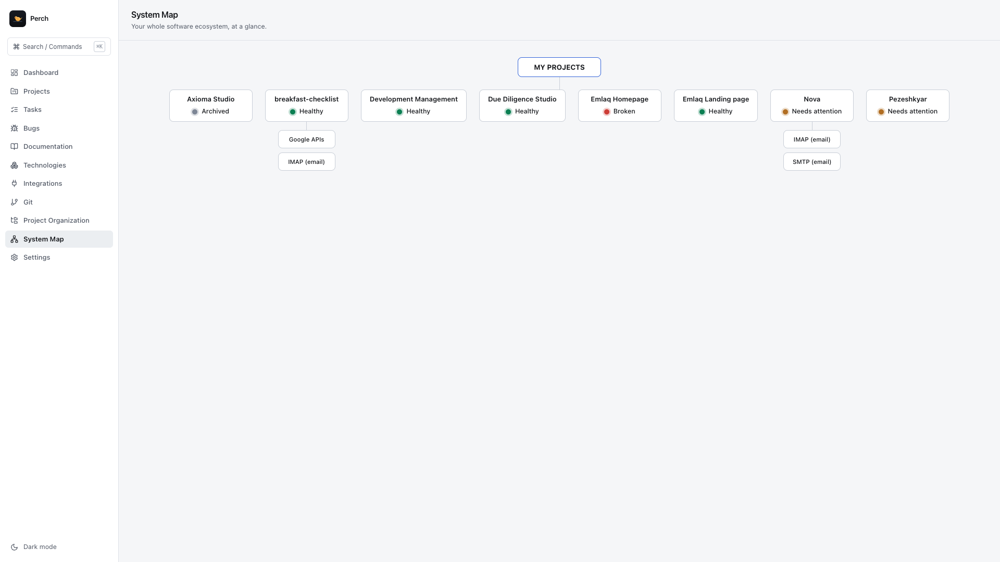
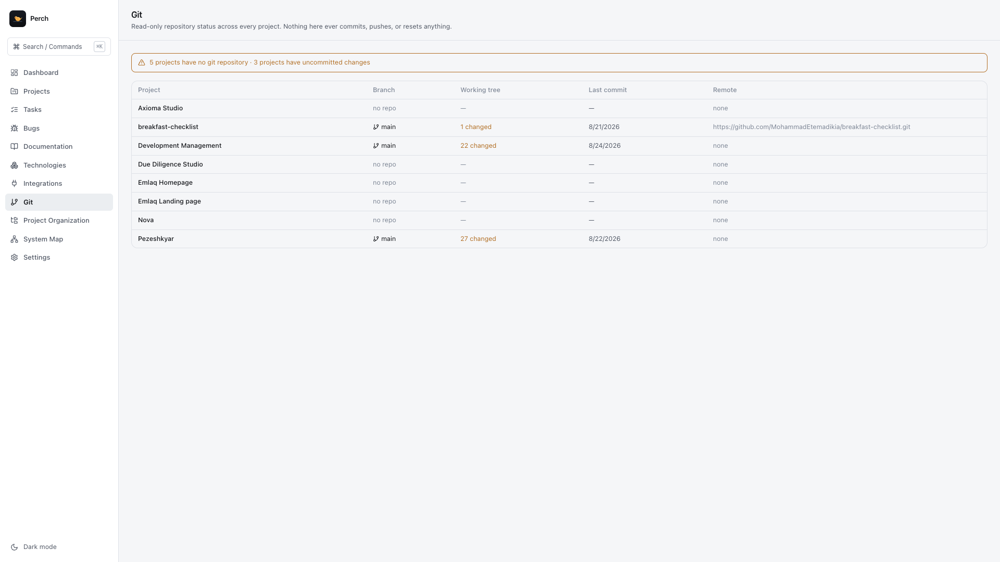
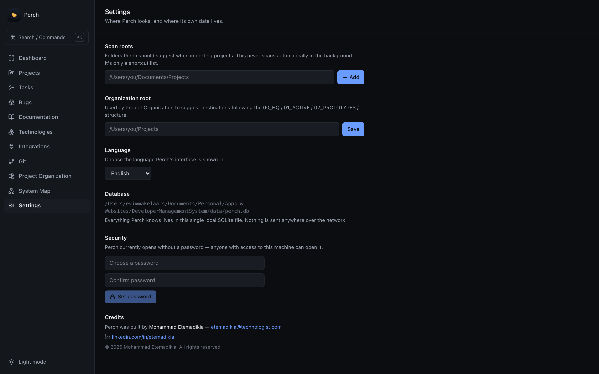
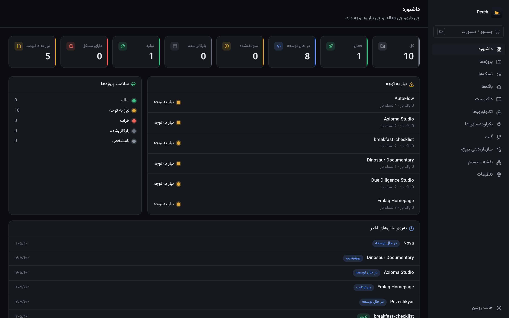

<p align="center">
  
</p>

<h1 align="center">Perch</h1>

<p align="center">A local-first <strong>Project Command Center</strong> for developers managing many software projects.</p>

Not a task tracker — a single place to see what you have, what's active, what's broken, and what needs attention across every project you own.

Built as a desktop app (Electron + Next.js + SQLite) so it runs entirely on your machine, with real filesystem and git access, and no dependency on any cloud service.

## Download

Grab the latest build for your platform from the [Releases page](../../releases/latest) — macOS (Apple Silicon or Intel) and Windows (installer or portable) are available. No account, no cloud dependency, nothing phones home.

## Screenshots

| | |
|---|---|
|  |  |
| Dashboard | Projects |
|  |  |
| Project detail | Per-project Kanban tasks |
|  |  |
| System Map | Read-only git status |
|  |  |
| Settings | Full English / Persian / Dutch UI, with RTL support |

## What it actually does

- Scans real project folders on disk — detects framework, language, package manager, database, git status, environment variable *names* (never values), and deployment config. Nothing about a project is invented; anything undetectable is shown as unknown.
- Tracks tasks, bugs, and a changelog per project (with an option to import changelog entries straight from git history).
- Generates project documentation (`CLAUDE.md`, `PROJECT_OVERVIEW.md`, `ARCHITECTURE.md`, `SETUP.md`, `API.md`, `DATABASE.md`, `CHANGELOG.md`) from what's actually recorded about a project — always as a diffable preview first, never overwriting an existing file without explicit confirmation.
- Shows read-only git status (branch, last commit, uncommitted files, remote) for every project. It never commits, pushes, resets, or otherwise touches git history.
- Plans project folder moves as a dry run — checks, warnings, and an explicit confirmation step before anything is moved on disk.
- Gives you a System Map of your whole software ecosystem and its external integrations.

See `SAFETY.md` for the full list of what this app will and will not do to your files.

## Running it

```bash
npm install
npm run db:seed   # optional — only if you want to seed from scripts/seed.ts
npm run dev        # opens at http://localhost:4100
```

To run as the actual desktop app:

```bash
npm run app
```

To build distributable installers:

```bash
npm run package:mac    # or package:win / package:linux
```

See `SETUP.md` for details, including the native-module rebuild step that's required for the desktop app specifically.

## Documentation map

- `USER_GUIDE.md` / `USER_GUIDE.fa.md` — every feature explained, plus install & run instructions (English / Persian)
- `CLAUDE.md` — instructions for a future Claude session working on this codebase
- `ARCHITECTURE.md` — how the pieces fit together
- `SETUP.md` — full setup, including the Electron native-module gotcha
- `PROJECT_STRUCTURE.md` — what's where
- `SAFETY.md` — exactly what destructive actions exist and how they're gated
